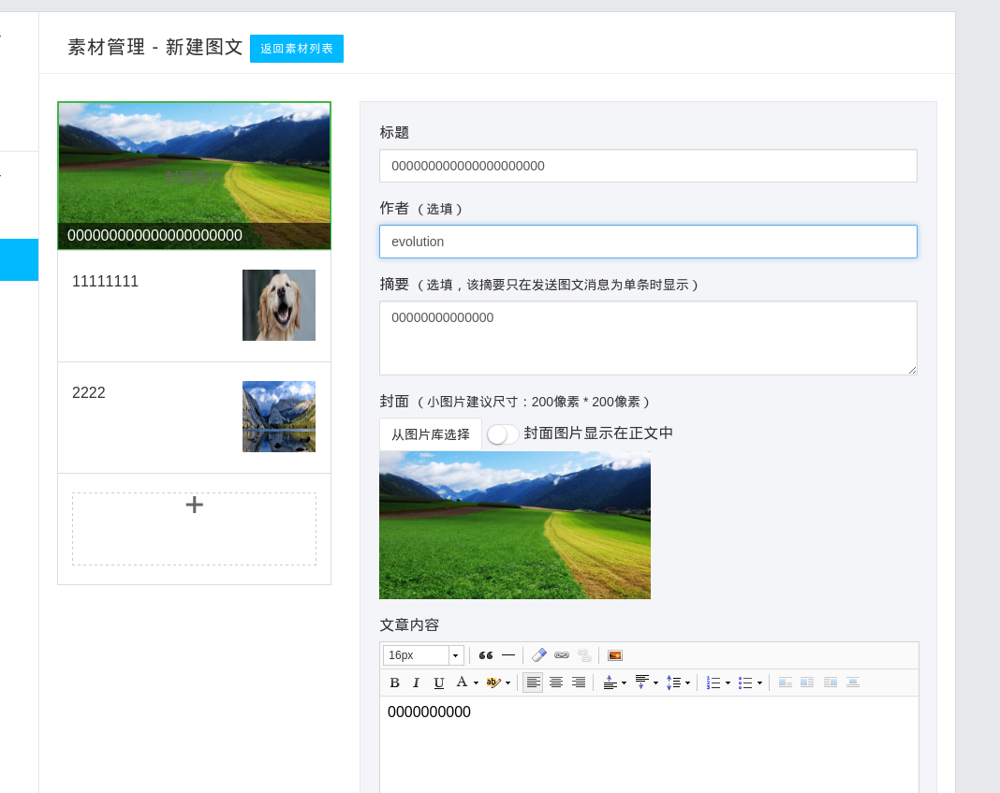
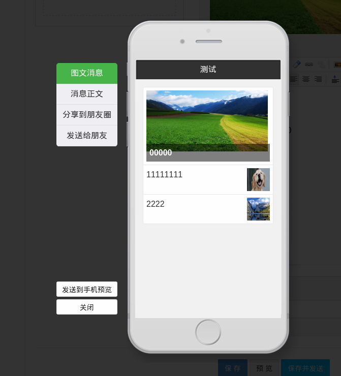
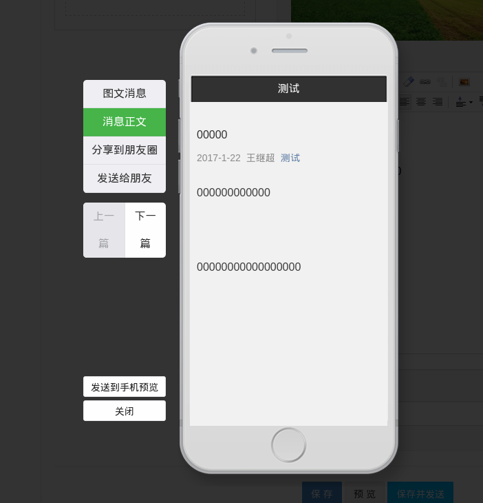
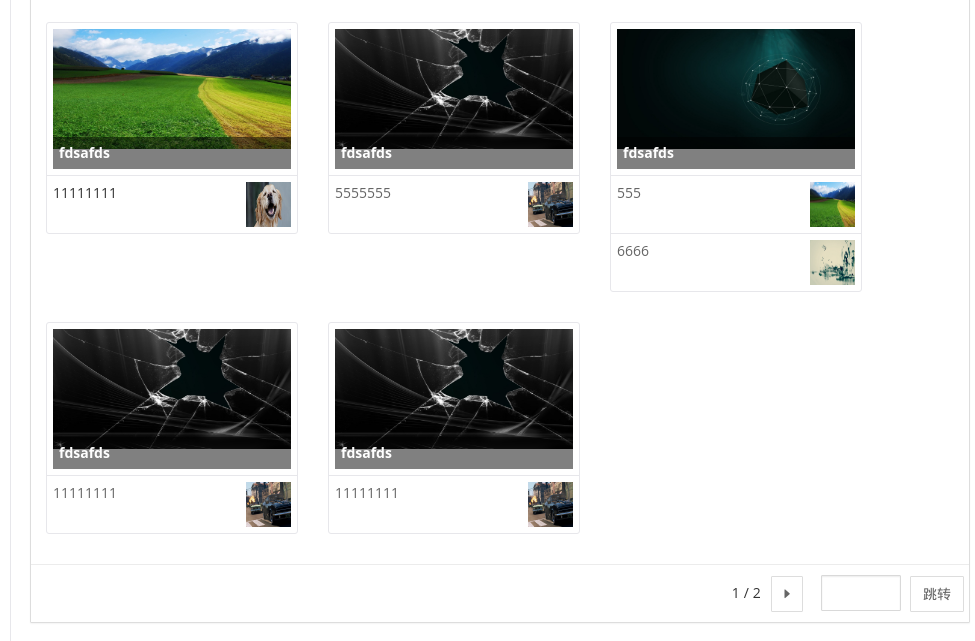
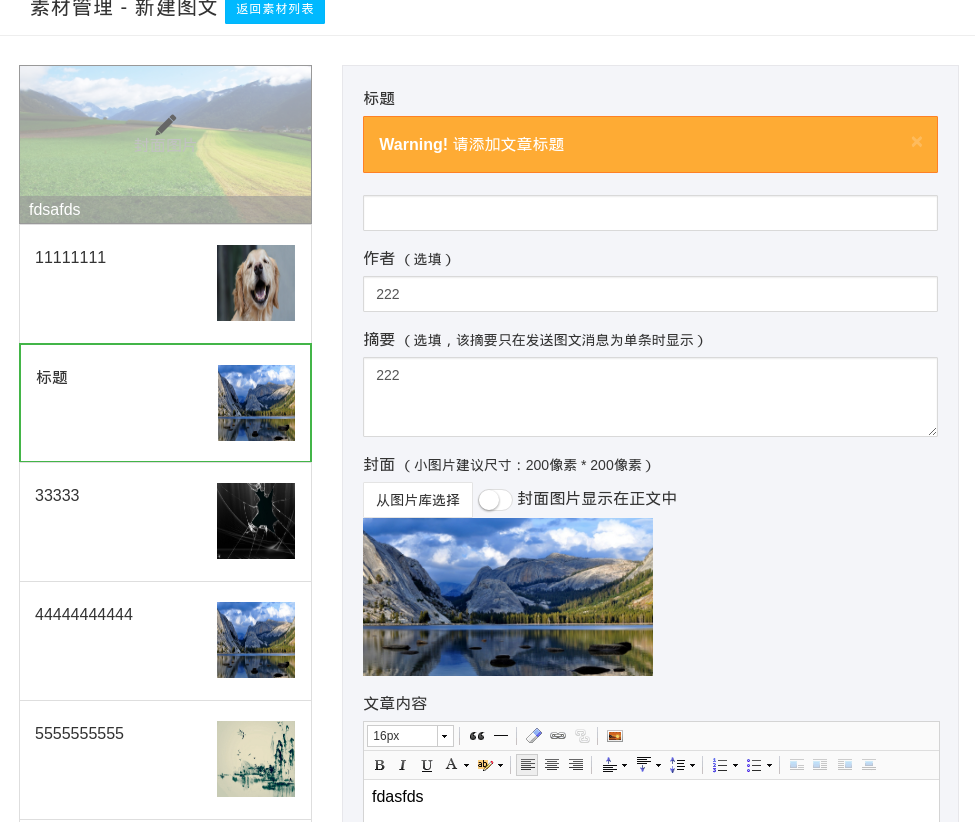

> 这里只是为了看到该项目的详细变更, 在开始之前请`务必`查看 原作者的说明 [readme](readme-viease.md)

## 注意
> 本项目改动较大 是基于vieasehub/viease进行的修改开发, 需要开发的真的不少, 希望感兴趣的朋友一起来
> 上传到微信素材的图片每个都存到本地一份得原因是想在本地预览的时候使用,因为微信素材不能在其他的域名下访问
> media_id 实际是本地的id标示,  真正的微信media_id是存在了original_id里面才是原始素材id

## fork之后改变的内容
1. easywechat
使用3.* 原来使用的是2.*
2. ueditor
使用的laravel-ueditor
因为一些原因上传图片已经在源码上进行了修改, 将文章图片直接传到微信,返回的是微信的图片url
3. 对新增图文消息进行了大量修改
4. 新增微信公众号的时候会进行素材的同步,这里有时候会超时, 考虑可以加到artisan中
5. 同步公众号信息哪里也用easywechat3.x从新修改

## 修改的部分预览

## todo list
### 图文编辑
1. 更新图文现在还是新增
2. 保存之后的图文还不能发布
3. 